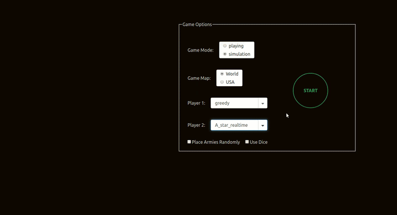

# RISK AI Game
This project is a simplified browser based implementation including several AI agents for the popular game "Risk".

## Features
The game supports two modes. Human vs AI (playing mode) and AI vs AI (simulation mode).

The game starts with an occupation phase players take turns selecting the countries they would like to occupy, positioning one unit at a time.

Then the war phase starts where players can attack other players based on the rules of the game.

### AI Agents
We implemented several AI agents which you can choose to play against. The agents differ in their strategy and state space search algorithm. Here are the agents we implemented:
* A* search
* realtime A* search
* Minimax
* Greedy
* Agressive
* Pacifist

We used the __Border Security Ratio__ heuristic from [this paper](https://project.dke.maastrichtuniversity.nl/games/files/bsc/Hahn_Bsc-paper.pdf) as the heuristic for the A* and minimax agents.
## Technologies
The game is implemented using React.js for the frontend side and python scripts for the AI agents with a simple flask server for client server communication. We use boardgame.io for managing and defining game state, moves, rules and transitions.

## Demo


## Setup
Clone the repo, then:

To start the client run

```
cd Risk-game-and-AI/client
npm i
npm start
```

To start the server

```
cd server

# install the python dependencies
pip install numpy flask flask-cors

# run the server
flask run
```
